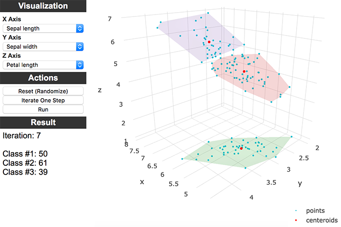

# kmeans-iris

This is my k-means assignment, applied on iris dataset.
Simple web-app featuring 3D visualization while iterations.

Available on: [https://deniz.co/kmeans-iris](https://deniz.co/kmeans-iris)

