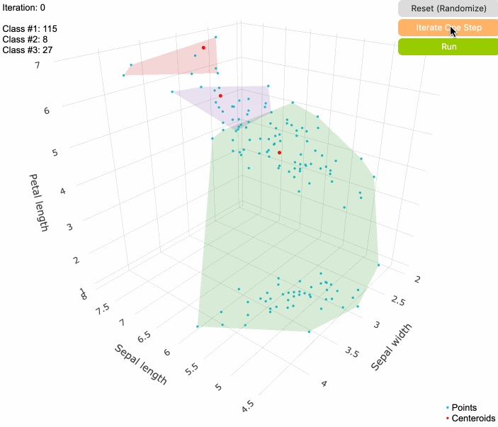

# kmeans-iris

Exploration into k-means algorithm, applied on [iris dataset](https://archive.ics.uci.edu/ml/datasets/iris).
Simple web-app featuring 3D visualization while iterations.

Available on: [https://deniz.co/kmeans-iris](https://deniz.co/kmeans-iris)

## Installation & Running

- Clone the repo
- Install the dependencies with `npm i`
- Open `src/index.html` in your favorite browser

